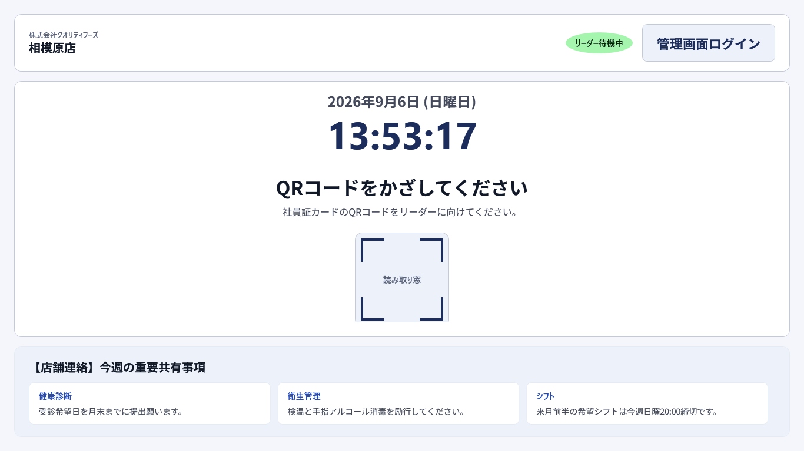
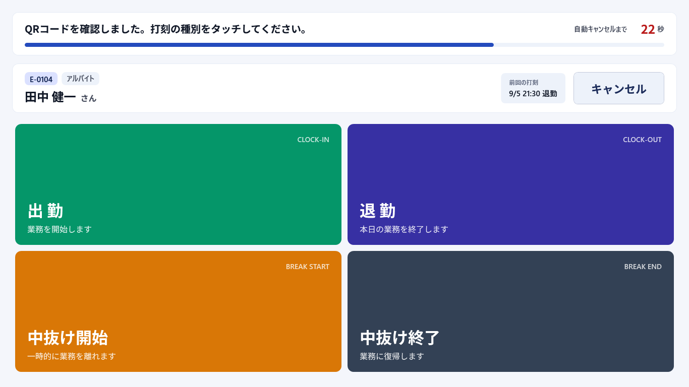
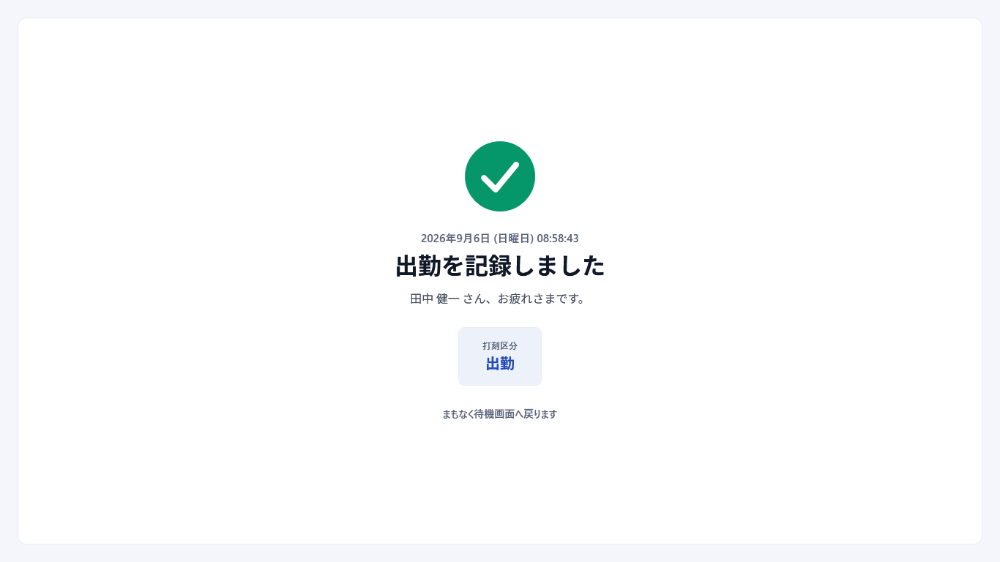
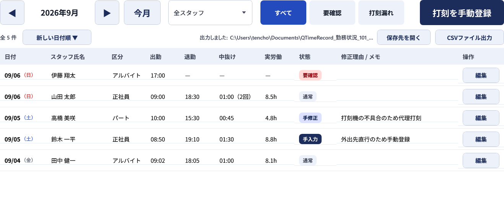
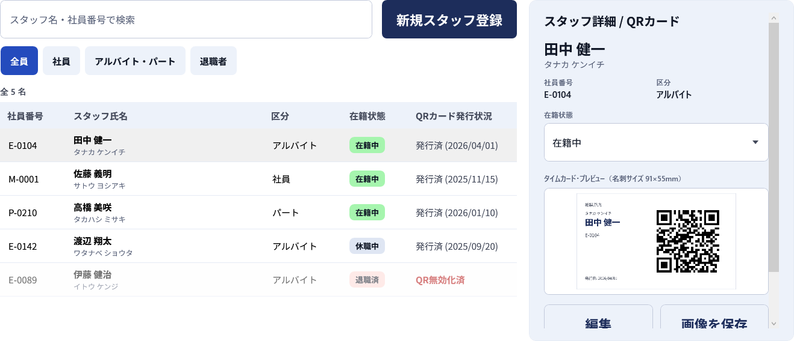
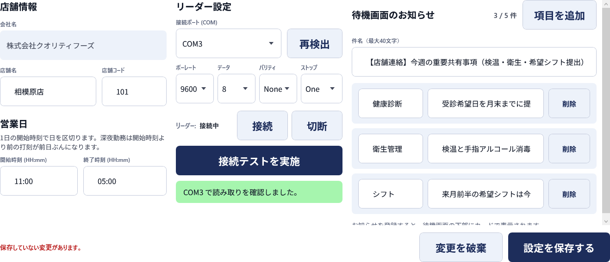

# QTimeRecord

小規模事業所向けの、**デジタルタイムカード**です。

店舗に置いたタッチ端末に社員証のQRコードをかざすと、出勤・退勤・中抜けが記録されます。
インターネットにつながっていなくても動きます。

Windows デスクトップアプリ（WPF / .NET 10 / SQLite）。

---

## 画面

### 待機画面

QRコードを待つ、通常時に表示され続ける画面です。店舗からのお知らせも出ます。



### 打刻

QRを読み取ると、打刻の種別を選ぶ画面へ進みます。**30秒操作がないと自動でキャンセル**します。
他人の名前が出たまま残ると、次の人がその名前で打刻してしまうためです。



記録できたことが一目で分かるように表示し、数秒で待機画面へ戻ります。



### 勤務状況（管理画面）

**1行 = スタッフ1名 × 営業日1日**。手入力・手修正・要確認をバッジで色分けします。
月ぶんを CSV（UTF-8 BOM付き）で出力できます。



### スタッフ管理（管理画面）

登録すると同時にQRコードを発行します。名刺サイズのカードをPNGで保存して印刷し、本人へ渡します。



### 店舗設定（管理画面）

営業日の区切り、QRリーダーの接続、待機画面のお知らせを設定します。



---

## できること

| | |
|---|---|
| **打刻** | 出勤 / 退勤 / 中抜け開始 / 中抜け終了 の4種 |
| **本人確認** | QRコード（シリアル接続のリーダー） |
| **勤務状況** | 月別の一覧、スタッフ・状態での絞り込み、手動登録・修正・削除 |
| **CSV出力** | UTF-8 BOM付き。Excel でそのまま開ける |
| **スタッフ管理** | 登録・編集・在籍状態（在職 / 休職 / 退職）、QRカードの発行・再発行 |
| **管理者認証** | 8桁PIN。5回失敗で5分ロック（再起動しても解除されない） |

### 対象外（MVP）

会社サーバー通信 / クラウド同期 / 複数店舗の集中管理 / 給与計算 / シフト管理 /
通常休憩の打刻 / 休憩の自動控除 / Web管理画面 / スマホアプリ

---

## 動作環境

| | |
|---|---|
| OS | Windows 11 |
| 画面 | 1366×768 以上。タッチ操作を推奨 |
| QRリーダー | **シリアル通信（COMポート）対応**のもの。キーボードとして動くタイプは使えません |
| .NET | **インストール不要**（アプリに同梱して配布します） |

---

## 導入

店舗のパソコンへの導入手順は **[deploy.md](deploy.md)** にまとめています。
専門知識がなくても進められるように書いています。

配布用のファイルは次のコマンドで作ります。

```bash
dotnet publish QTimeRecord.App -c Release -r win-x64 --self-contained true -p:PublishSingleFile=true -p:IncludeNativeLibrariesForSelfExtract=true -p:EnableCompressionInSingleFile=true -o publish
```

---

## 開発

### 必要なもの

- .NET SDK 10.0 以上
- Windows（WPF のため）

### コマンド

```bash
dotnet build QTimeRecord.slnx
dotnet run --project QTimeRecord.App
dotnet test QTimeRecord.Tests
```

テストだけ絞り込むとき:

```bash
dotnet test QTimeRecord.Tests --filter "FullyQualifiedName~PunchState"
```

**ビルドは警告ゼロを維持しています**（`TreatWarningsAsErrors`）。

### 構成

```
QTimeRecord.Core/     ドメイン・DB・シリアル通信・ユースケース（WPF非依存）
  Domain/             エンティティ・状態遷移・営業日・日次集計
  Data/               DbContext・マイグレーション・Repository
  Services/           ユースケース（打刻する / CSVを出す / 認証する）
  Devices/            シリアル通信・QR受信
  Infrastructure/     パス解決・ログ設定・アプリ設定

QTimeRecord.App/      WPF（View / ViewModel / Controls / Resources）
QTimeRecord.Tests/    xUnit
```

業務ロジックを WPF に依存させていません。単体テストのためと、
将来 Web 管理画面から再利用できるようにするためです。

```
 View (XAML) ─Binding─▶ ViewModel ─▶ Service ─▶ Repository ─▶ SQLite
                                     ここに業務ルールを集約

 SerialPort ─▶ ScanBuffer ─▶ QrScannerService ─(event)─▶ ViewModel
              終端で分割      接続管理・再接続
```

---

## 設計上の要点

素直に作ると壊れる箇所です。詳しくは [CLAUDE.md](CLAUDE.md) にまとめています。

### 日付は「カレンダー日付」ではなく「営業日」

店舗設定の**1日の開始時刻**で日を切ります。開始 11:00 の店舗なら、`09/06 02:00` の退勤は
`09/05` の営業日に属します。22:00 出勤 → 翌 02:00 退勤は**同じ1件の勤務**として1行にまとまります。

深夜まで営業する店で、ここを間違えると勤怠が2日に割れます。

導出は `Domain/BusinessDayResolver.cs` に集約し、打刻・集計・CSV はすべてここを通します。

### 打刻をブロックしない

「出勤 → 出勤」のような異常な遷移でも、**警告したうえで記録します**。
現場で打刻できないことの損害のほうが大きく、管理者が後から修正できる設計になっています。

保存しないのは「同一種別を60秒以内に繰り返した場合」（連打・二度読み）のみです。

### 打刻の保存失敗を成功に見せない

DB書き込みに失敗したら必ずエラーを表示して待機画面へ戻します。
打刻は勤怠の証跡であり、静かに失われてはいけません。

SQLite は `journal_mode=WAL` / `synchronous=FULL` で開き、打刻ごとに即コミットします。
**打刻直後にプロセスを強制終了しても記録が残ること**を確認済みです。

### スタッフを物理削除しない

在籍状態（在職 / 休職 / 退職）で論理管理します。打刻レコードが参照しているため、
削除すると過去の勤務記録が壊れます。

### ログに個人情報とQRトークンを書かない

氏名ではなく `staff_id` を記録します。QRトークンは平文で残さず、SHA-256 の先頭8文字のみ。
管理者PINは桁数も残しません。

**残らないことをテストで固定**しています。氏名やトークンが混ざっても動作は変わらないため、
書いた本人以外は気づけないからです。

---

## テスト

```
534 件（うち 17 件は画面の目視確認用のため通常はスキップ）
```

実機（QRリーダー・プリンタ・設置端末）が必要な項目は自動化できません。
手順を **[実機テスト手順.md](実機テスト手順.md)** にまとめています。

とくに**電源断のテスト**は、勤怠データが失われないことの最終確認です。

---

## ドキュメント

| ファイル | 内容 |
|---|---|
| [plan.md](plan.md) | 実装計画かつ進行管理台帳。全20章・101工程。**設計判断とその理由**を記録 |
| [deploy.md](deploy.md) | 店舗PCへの導入手順 |
| [実機テスト手順.md](実機テスト手順.md) | 実機でしか確かめられない項目の手順 |
| [CLAUDE.md](CLAUDE.md) | 設計上の必須ルール。コードを書く前に読むもの |
| [DESIGN.md](DESIGN.md) | デザイントークン（Precision Kiosk Blue） |

---

## サードパーティのライセンス

使用しているパッケージの著作権表示とライセンス本文は
[THIRD-PARTY-NOTICES.txt](THIRD-PARTY-NOTICES.txt) にまとめています。
**配布時は必ず同梱してください**（MIT / Apache-2.0 の要求事項です）。
